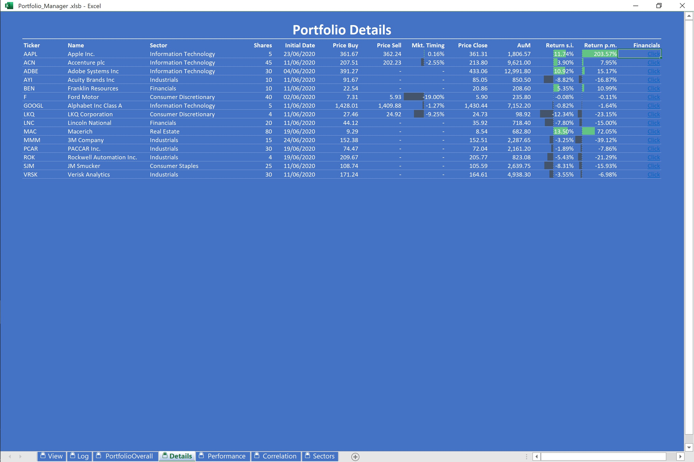

# VBA_Stock-Portfolio-Manager
This VBA application allows user to retrive real-time financial information of stocks in US Market. Users can also simulate to perform Buy and Sell action and monitor the performance of portfolios. 

Some key codes are provided under foloder "key codes"

## Authors
This application is built by Bernhard Pfann and Lurong Mao  
Calandar Form is from [Excel880.com](http://excel880.com/blog/archives/12375)

## Feature (2020.08.01)
1. Retrieve real-time financial information (Shown as "View Page" below)
2. Simulate to perform Buy and Sell action in real-world
3. Update portfolio with price history from first trading date to the last tradig date
4. Monitor the portfolio performance interactively
5. Get the correation analysis among stocks

## Instruction
#### View Page

  

+ Click "Maginifier" icon to explore the stock information  
  
  _After you explore the stock information, the application will keep updating the live price for you every 1 minute. If the updating infuence the performance of the application, you can click " Stop Updating" to pause the progress._  
    
+ Click "BUY" to perform buy action and click "SELL" to perform sell action  
  
  _Please be noted that you are only allow to trade with the real-world, meaning that you can only perform the action when the market opens. Usually, US Market opens on Monday to Friday, from 9:30 a.m. t0 4 p.m.._  
  
+ Click "UPDATE" after you perform "buy" or "sell" action to update portfolio performance

#### Log Page  

Everytime after you perform a trading action, the trasaction will be recorded in "Log" page where you can have the overview of your cash flow 

    

+ Click "Clear Records" to clear all your transaction history  
_NOTED: This action will PERMANANTLY delete all your transaction records and recover your application to in the initial status!

#### PortfolioOverall Page  

You can have an overview of your portfolio at this page which will list the stock value, cash value, total value, cash ratio and invest ration for every market trading days from your first trading dates till the last trading dates.  

  

+ Click the Date Cells near "Start Date" and "End Date" to select the period that you want to monitor  

#### Details Page  
  
You can have the details for each stock in this page

  
+ Click Cells under "Fiancials" to view the fiancial reports for each stock  
  
#### Performance Page  

You can monitor the performance of each stock you traded in this page  

  

+ Click the Date Cells near "Ticker" to select the stock
+ Click the Date Cells near "Start Date" and "End Date" to select the period that you want to monitor 

#### Correlation Page  

This page shows the correlations among stocks you traded

  

#### Sector Page  

This page shows AuM for industry sectors you invest

  

